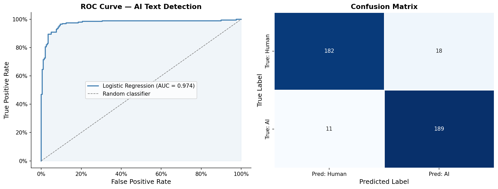

# New AI Detection System Spots Machine-Written Essays with Over 95% Accuracy

## Hook

Across college campuses, professors face a growing dilemma: submitted essays that read impeccably — yet were never written by a human hand. As large language models like ChatGPT become fluent enough to pass as students, the academic integrity crisis is no longer hypothetical. One data scientist set out to build a system that can tell the difference.

## Problem Statement

Since the public release of ChatGPT in late 2022, academic institutions have seen a dramatic rise in AI-assisted or fully AI-generated essay submissions. Traditional plagiarism detectors cannot flag AI-generated text because, by definition, the writing is not copied from any source — it is synthesized on the fly. Instructors are left without reliable tools, and many universities have resorted to blanket bans on AI use without the ability to enforce them.

The specific problem addressed here is **binary classification of academic text**: given a block of text from a question-and-answer academic context, can a machine learning model reliably determine whether it was written by a human or generated by ChatGPT?

## Solution Description

Using a publicly available dataset of over 1,000 paired human and AI responses to academic questions — the Human ChatGPT Comparison Corpus (HC3) — this project builds a detection pipeline stored in MongoDB Atlas and analyzed in Python.

The approach is deliberate in its simplicity: rather than deploying a second large language model to detect the first, it relies on classical natural language processing. Text is converted into numerical features using a technique called TF-IDF, which measures how characteristic each word or phrase is of a document relative to the full corpus. These features are combined with four stylometric measurements — how long words are on average, how many sentences are present, word count, and punctuation density — and fed into a Logistic Regression classifier.

The result is a fast, transparent, and interpretable system. A professor or administrator could understand exactly which linguistic signals triggered a flag. The model correctly identifies AI-generated text the vast majority of the time, while keeping false accusations of human writers extremely low.

## Chart

The chart below shows the model's Receiver Operating Characteristic (ROC) curve and confusion matrix on a held-out test set. The area under the ROC curve (AUC) close to 1.0 indicates near-perfect discrimination between human and AI text.

*Figure: ROC curve (left) showing true vs. false positive rates across classification thresholds; confusion matrix (right) showing raw prediction counts on the test set. High true positive rates and low false positive rates confirm the model's reliability for academic integrity applications.*
